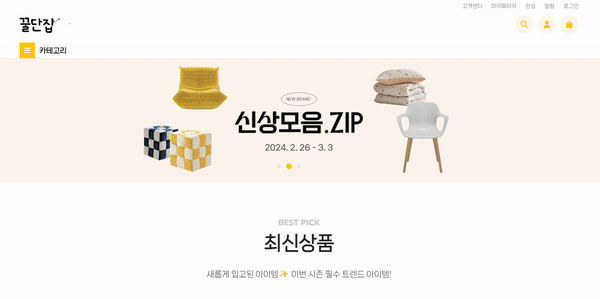
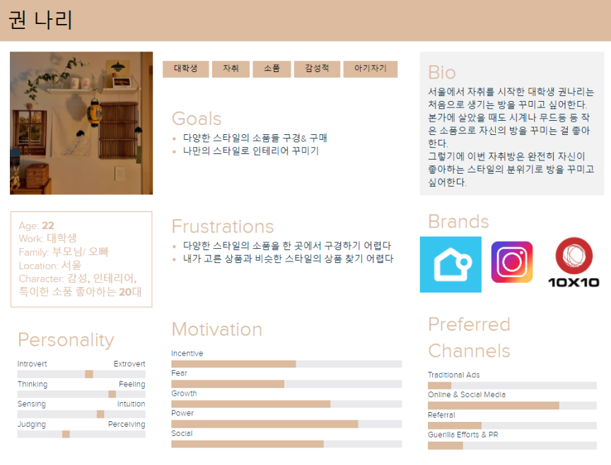
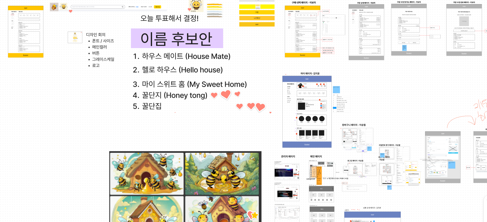
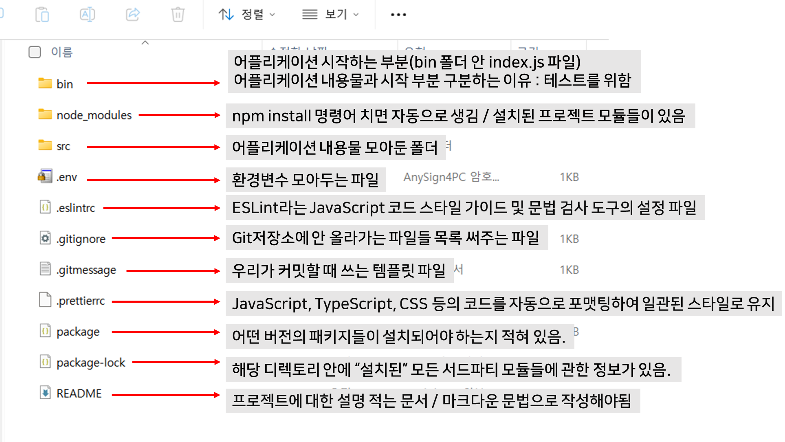
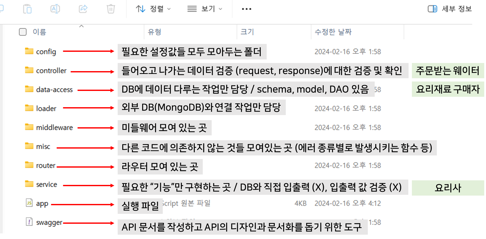
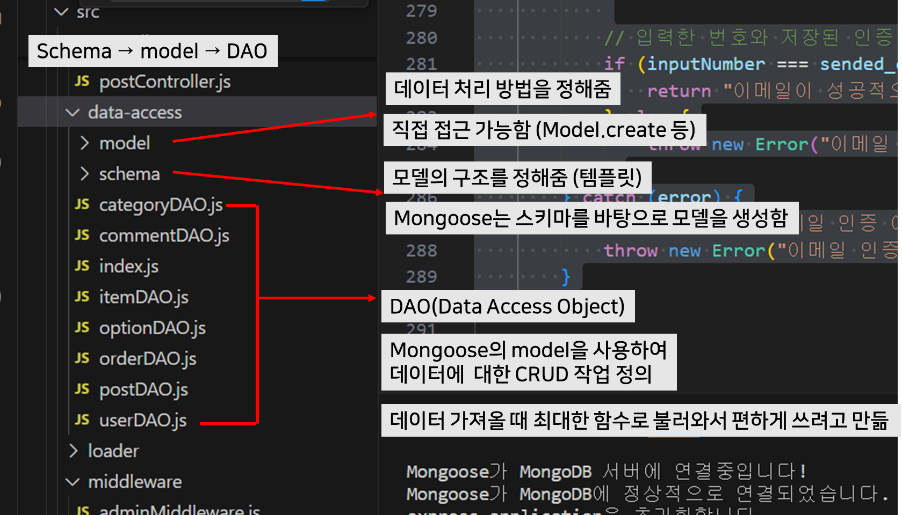
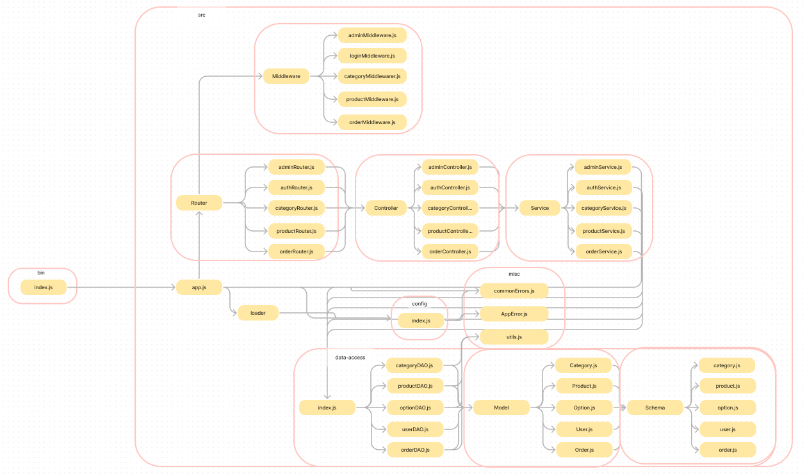
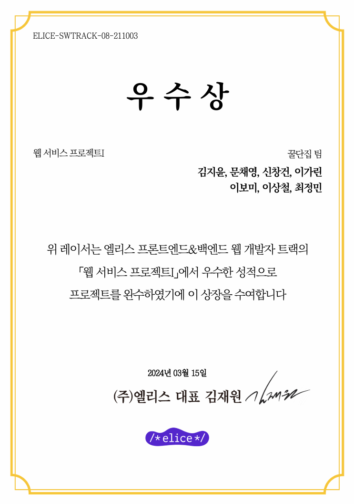

---

</br>

> ✍️ **글을 시작하며**

엘리스🐰에서 첫 팀 프로젝트를 하게 되었습니다. **기획부터 개발까지** 열정적이고 밝은 팀원들 덕분에 더 잘할 수 있었습니다 🫰

저는 프론트엔드 지망생이지만, 서버 개발을 경험해보고자 백엔드로 지원했습니다. 백엔드로서 스키마 구상, API 개발, 서버 배포 등의 다양한 업무를 경험해볼 수 있었습니다. 프로젝트 진행 중 시간이 부족해 프론트엔드 부분도 도울 기회가 생겼고, 덕분에 백엔드와 프론트엔드의 연관성을 배울 수 있었습니다.

---

### 📅 **전체 일정**

프로젝트 개발 : 2/19(월) ~ 3/1(금)</br>
최종 발표 : 3/2 (토)

---

### **👀 꿀단집 ( Honey Touse )**


> **"당신의 감성을 흔드는 인테리어 꿀템이 가득한 꿀단집"**

> "특별한 감성을 담은 소품과 가구를 원하는 당신을 위한 꿀템이 가득!<br>
> 저희 꿀단집에서 만나보세요.” 🍯🏠


  요즘 1인가구의 증가와 워라벨에 대한 높아진 인식으로 집에 있는 시간이 늘어남에 따라 휴식공간인 집의 인테리어에도 많은 관심이 몰리고 있습니다.
  
  </br>이에 따라 이들의 **라이프스타일과 취향에 맞춘 가구를 제공하기 위해** 인테리어 쇼핑몰을 기획하게 되었습니다.



---

### 💫 **시연 영상**

[꿀단집](https://youtu.be/5DiQ-FD5xv8): https://youtu.be/5DiQ-FD5xv8

<iframe src="https://www.youtube.com/embed/5DiQ-FD5xv8" width="860" height="484" frameborder="0" allowfullscreen="true"></iframe>

---

### 🥸 **기획**

모두가 첫 프로젝트인만큼 시작은 어려웠습니다. 하지만
매일 10시 스크럼타임을 정해두고 게더타운에서 상주하며 소통하였습니다.

피그잼을 이용해 같이 기획하고 같이 정했습니다.



다들 적극적으로 의사소통을 해주신 덕분에 수월하게 나아갈 수 있었습니다 😁

### 🖥️ **개발**

백엔드는 처음이라 많이 부족했습니다.

스키마와 API 명세서를 수정하고 작성하고 수정하고 반복...</br>
나중엔 초반에 API명세서 작성이 얼마나 중요한지 깨달았습니다.

데이터 구조를 공부하고





프로젝트의 코드 의존성 그래프를 만들어 보았습니다. !



---

### 🎈**회고**

#### Keep 👍💪

- 팀원들의 적극적인 의견과 원활한 의사소통
- 포기하지 않고 에러를 해결하려고한 점
- 모르는 부분을 함께 공유하고 의논한 점
- 일정이 늦어진 팀원도 도와준 점

#### Problem 😅

- 트러블 슈팅에 대해 상세히 기록하지 않은 점
- API명세서 작성이 부실했던 점
- 개발 진행 상황이 원활하게 공유되지 못한 점

#### Try💪

- 팀원들의 진행상황을 상세히 기록하기
- 트러블 슈팅이나 회의를 문서화하기
- Git을 더 잘 이용하기

---

> 🐯 **끝**
> 

2주 동안의 짧은 프로젝트가 끝이 났다.

첫 프로젝트라 기대가 큰 만큼 열정도 컸지만, 부족한 점이 많아 팀에 민폐를 끼칠까봐 걱정이 되었다. 그래서 팀이 정해지자마자 매일 오전 10시에 **스크럼을 하자고 제안**했고, 다른 팀원들도 적극적으로 동의해주었다.

모든 팀원들이 첫 프로젝트여서 우리는 **기본 기능에 충실**하자는 목표를 세웠다. API는 생각보다 빨리 구현되었지만, 프론트엔드 부분에서는 시간이 부족했다. 관리자 API는 구현되었지만, 관리자 페이지를 만들 시간이 없었다. 다행히도 내가 예상보다 빨리 작업을 끝내어 관리자 페이지까지 구현해낼 수 있었다.

덕분에 초반에 기획했던 기능들을 대부분 구현할 수 있었고, 모든 팀원들이 적극적으로 의사소통을 해주어 **귀여운 꿀단집 프로젝트**를 완성할 수 있었다. 첫 프로젝트라 부족한 점이 많았지만, 앞으로 더 개선해나갈 생각이다.

```toc
1. ✍️ 글을 시작하며
2. 📅 전체 일정
3. 👀 꿀단집 ( Honey Touse )
4. 💫 시연 영상
5. 🥸 기획
6. 🖥️ 개발
7. 🎈회고
8. 🐯 끝
```
