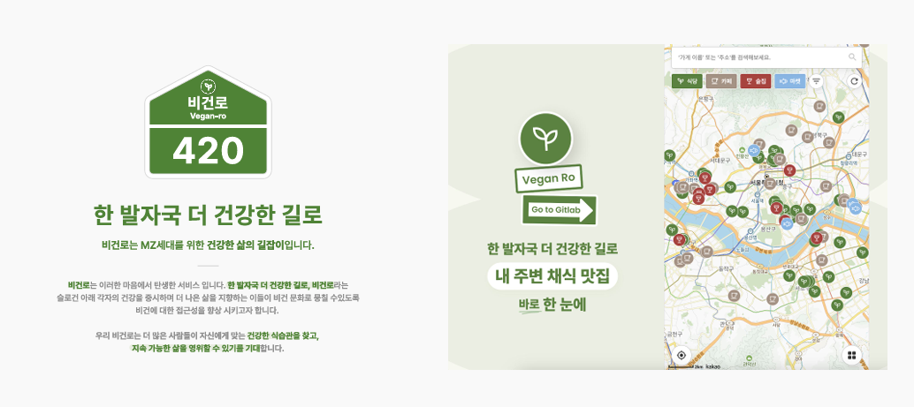
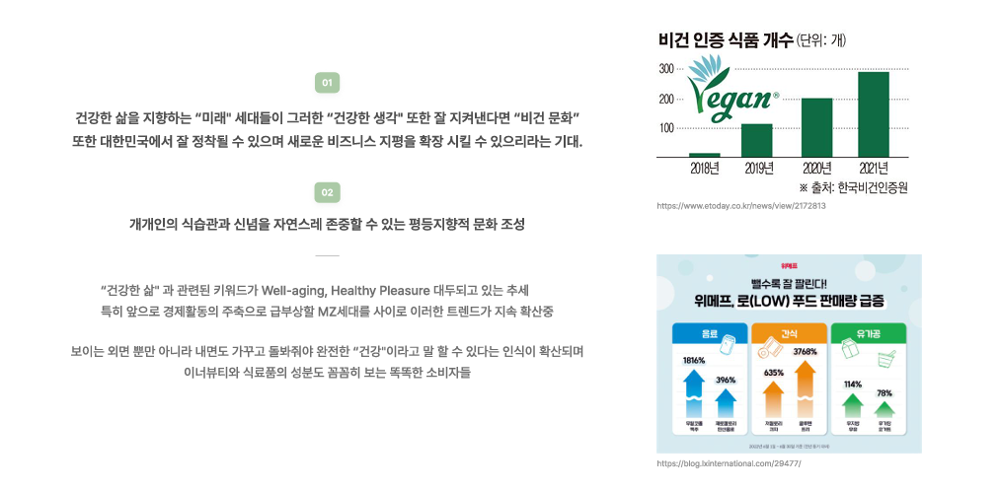
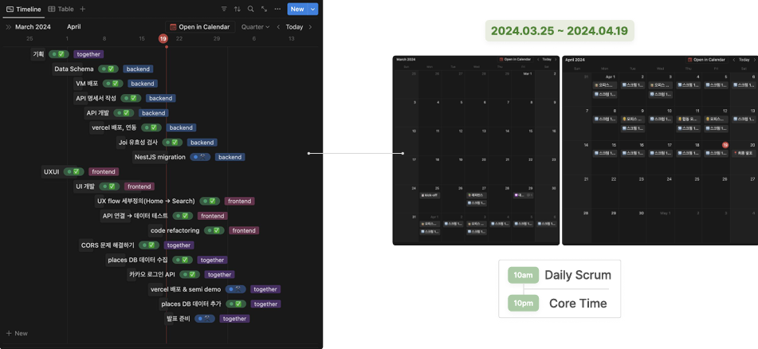
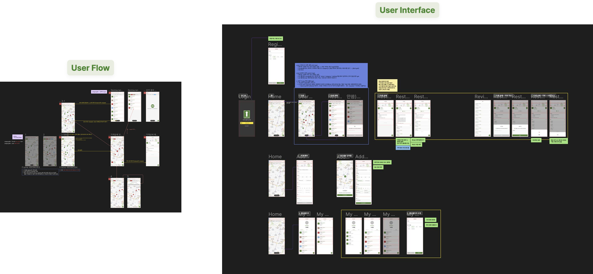
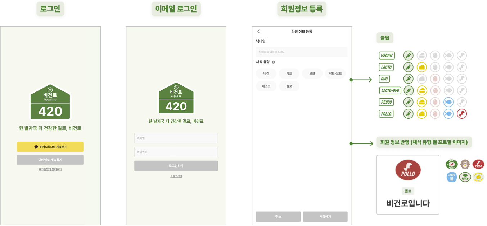
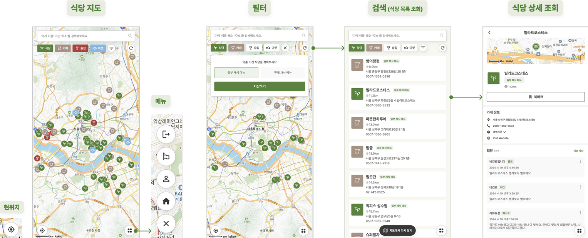
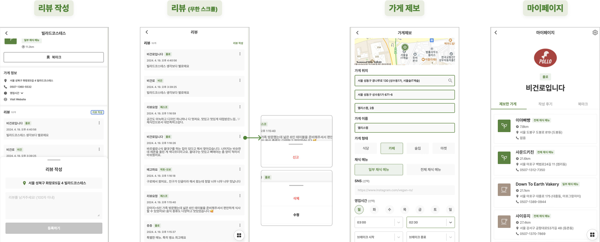
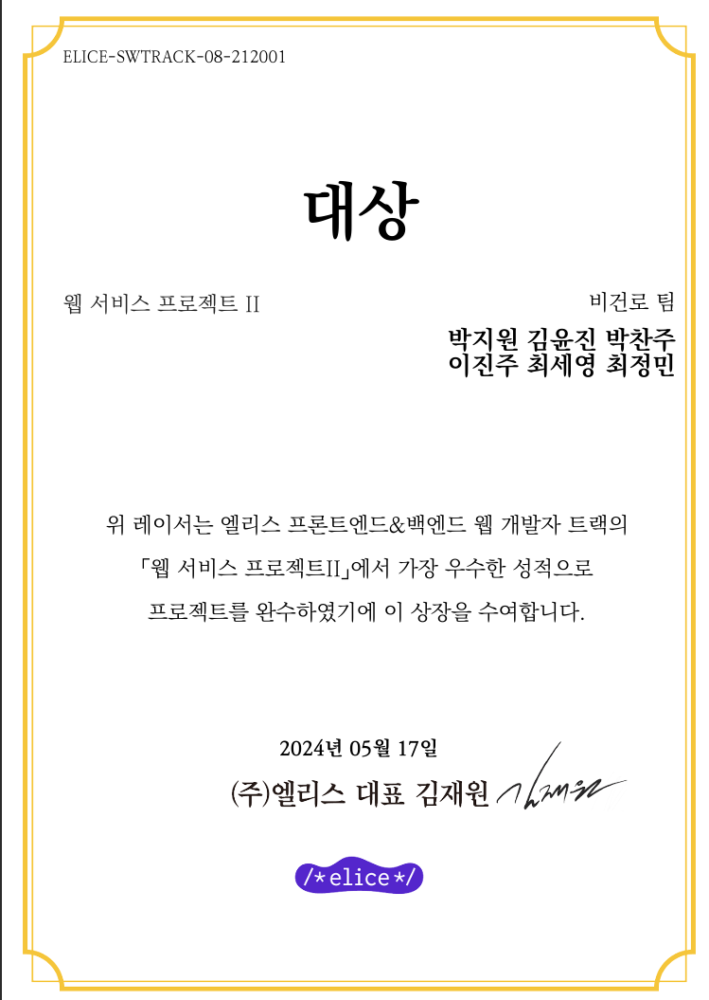
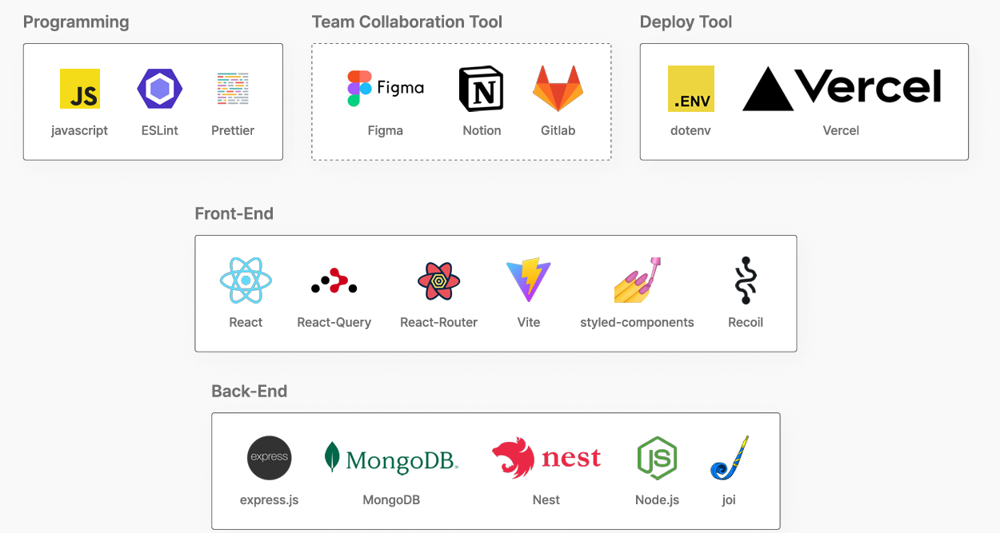

---

</br>

> ✍️ **글을 시작하며**

엘리스🐰에서 두번째 팀 프로젝트를 시작했습니다.

두 번째이지만 프론트엔드로써는 첫 프로젝트여서 기대가 되었습니다.
이번에도 열정적이고 적극적인 팀원들을 만나 좋은 결과물을 만들어 낼 수 있었던 것 같습니다. 😁

---

### 📅 **전체 일정**

프로젝트 개발 : 4/1(월) ~ 4/19(금)</br>
최종 발표 : 4/20(토)

---

### **👀 비건로 ( Vegan-ro )**




요즘 건강, 헬스와 같은 **건강한 삶**과 관련된 키워드가 트렌드로 떠오르고 있습니다. 개개인이 자신에게 더 맞는 **건강한 식습관을 찾고** **지속 가능한 삶을 영위할 수 있기를 기대**하면서 만든 **비건 장소 지도**입니다

---

### **💫 시연 영상**

[비건로](https://www.youtube.com/watch?v=7NQiQGzf-qI) : https://www.youtube.com/watch?v=7NQiQGzf-qI

---

### 🥸 **기획**



타임라인을 정하여 매일 스크럼하고 그 날 개인의 진행상황을 기록하였습니다.



플로우 차트를 작성하고 UI를 피그마를 통해 디자인하며, 전체적인 **프로젝트 구조와 사용자 화면을 구체화**할 수 있었습니다.

### 🖥️ **개발**

저는 **회원정보 등록페이지, 식당 상세페이지, 리뷰페이지, 마이페이지, 마이페이지 수정페이지**를 개발하였습니다.



지도라는 특성상 사용자의 편의를 고려하여 **로그인 없이**도 둘러볼 수 있도록 구현하였습니다.



**북마크를 통해 장소를 저장**할 수 있고, 장소에 대한 정보를 얻을 수 있습니다.



**리뷰를 작성, 수정, 삭제**할 수도 있고 **다른 사용자의 리뷰를 신고**할 수 도 있습니다.

**무한 스크롤을 통해 빠른 리뷰 로딩 속도를 제공**합니다.

마이페이지에서 제보한 가게, 작성한 리뷰, 북마크를 알 수 있습니다.
마이페이지 수정에서 채식 유형, 닉네임을 수정할 수 있습니다.

---

### 🎈**회고**

#### Keep 👍💪

- 소통방식 : Soft Skill
  메신저로 소통할 시 비언어적 정보의 불충분으로 발생할 수 있는
  불미스러움을 방지하며 장기적인 협업의 효율을 극대화
- 문서화 : 기록의 습관화
  메신저의 높은 휘발성 특징을 고려하여 팀원들 간의 효율적인 업무
  공유와 더불어 프로젝트 관리를 위해 문서화 협업 방식 채택

#### Problem 😅

- 개발 역량 파악 부족
  병아리 개발자라 개발 역량을 파악하지 못하여
  명확한 일정 수립이 어려움
  (+ 에러 수정으로 인한 딜레이 시간 고려)
- 처음 사용하는 외부 API 적용
  여러 외부 API를 사용하면서 처음 접하는 개발 환경 파악 어려움
  새로 사용하는 언어 및 문법 숙지 필요성

#### Try💪

- 상황 공유는 항상 up-to-date!
  내 일정은 결국 팀원들과 협업하는 프로젝트의 일부임을 명심하며
  진행 상황 뿐만 아니라 딜레이 이슈도 팀원들에게 공유하기
- 문법 : back to basics
  API 적용 및 익숙하지 않은 언어 사용 시,
  1. 공식 문서를 생활화 하기
  2. 개발 블로그에서 해결 방안을 찾아보기
  3. chatGPT 선생님에게 여쭤보기
     이를 바탕으로 내것으로 만들기

---

> 🐯 **끝**





다양한 언어들을 습득하고 적용하기에 짧은 시간이었다. 엄청난 분량 덕분에 쉬지않고 작업만 했던 것 같다. 그 결과, **독특하고 예쁜 디자인**으로 좋은 결과물를 얻을 수 있었다.

프로젝트는 끝이 났지만 아쉬운 부분이 많다. 😭

1. 사용자 편의를 위해서 바텀 시트가 클릭 시에만 닫을 수 있어 **드래그 시 닫힐 수** 있도록 개선하고 싶다.
2. 사용자들에게 더 많은 가치를 제공하기 위해 길찾기, 예약 등 많은 기능들을 추가하고 싶다.

이번 프로젝트는 더 발전하고 성장할 수 있었던 기회였던 것 같다. 비록 얕은 개발지식으로 시작했지만, 이번 경험을 통해 더 깊이 공부해야겠다는 생각이 들었다. 앞으로 더 많은 프로젝트를 통해 배움을 이어나가고 싶다. 👍

```toc
1. ✍️ 글을 시작하며
2. 📅 전체 일정
3. 👀 비건로 ( Vegan-ro )
4. 💫 시연 영상
5. 🥸 기획
6. 🖥️ 개발
7. 🎈회고
8. 🐯 끝
```
