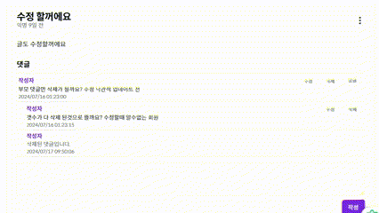
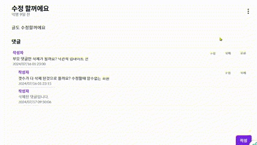

---

> ### 🙌 **소개**

커뮤니티 글, 댓글 및 답글 수정 기능을 구현하던 중에 댓글을 mutation으로 댓글을 수정처리한 뒤 쿼리를 invalidate하면 다시 refetch가 이루어지는 데에 시간이 걸리기 때문에, 확인 버튼을 누른 후 잠시 수정 전의 댓글이 표시되다가 0.5초쯤 후 수정된 댓글이 표시되는 현상이 생기는 것을 발견했습니다. 사용자 경험을 위해 댓/답글 수정에 낙관적 업데이트를 적용시키기로 했습니다!

> ### ✔️ **Optimistic Update (낙관적 업데이트)이 무엇일까**

낙관적 업데이트는 서버의 성공 여부와 관계없이, 해당 서버의 통신이 **성공했다고 가정**하고 UI를 **미리 업데이트**하는 방법입니다.

이렇게 하면 사용자에게 **빠른 피드백**을 제공할 수 있습니다. 주로 게시물 좋아요, 팔로우 요청 등 실시간으로 유저 피드백이 필요한 경우에 사용됩니다. 실제 서버와의 동기화는 백그라운드에서 이루어지며, 성공 시 UI 변경이 확정되고, 실패 시 초기 상태로 롤백됩니다.

React Query에서는 `post, patch, put, delete` 요청을 `mutation` 기능을 통해 처리하며, 이를 통해 쉽게 낙관적 업데이트를 구현할 수 있습니다.

> ### 🗒️ **수정코드**

**Tanstack Query의 공식 문서를 참조하여 구현했습니다.**

```
const updateCommentMut = useMutation({
		mutationFn: async ({ commentId, content }: { commentId: number; content: string }) => {
			const supabase = createClient();
			const { error } = await supabase
				.from('post_comments')
				.update({ content })
				.eq('id', commentId);
			if (error) {
				throw error;
			}
		},
		onMutate: async ({ commentId, content }) => {
			await queryClient.cancelQueries({ queryKey: ['comments', postId] });

			const previousComments = queryClient.getQueryData<{ comments: CommentWithReplies[]; anonyIndexMap: Map<number, number>; }>(['comments', postId]);

			if (!previousComments) return;

			const updatedComments = {
				...previousComments,
				comments: previousComments.comments.map((comment) => {
					if (comment.id === commentId) {
						return { ...comment, content };
					}
					return comment;
				}),
			};

			queryClient.setQueryData(['comments', postId], updatedComments);

			return { previousComments };
		},
		onError: (err, newComment, context) => {
			if (context?.previousComments) {
				queryClient.setQueryData(['comments', postId], context.previousComments);
			}
			toast.error('댓글 수정에 실패했습니다');
		},
		onSettled: () => {
			queryClient.invalidateQueries({ queryKey: ['comments', postId] });
			setEditingCommentId(null);
		},
	});
```

> ### **낙관적 업데이트 전 vs 후 차이 보시죠**




> ### 🔆 **결론**

낙관적 업데이트는 사용자 인터페이스가 **즉각적으로 반응**하므로 사용자 경험이 향상될 수 있는 장점이 있습니다. 그러나 데이터 불일치 가능성이 발생하는 경우에는 사용자에게 **신뢰도를 낮추는 단점**으로 이어질 수 있습니다.

예를 들어, SNS에서 사용자가 게시물에 `좋아요`를 누를 때 시스템은 즉시 해당 `좋아요` 버튼의 상태를 변경하고 `좋아요` 수를 증가시킵니다. 동시에 서버에 요청을 보내 실제로 `좋아요`가 저장됩니다. 사용자는 즉시 `좋아요`가 반영되는 것을 보고 시스템이 빠르고 반응적이라고 느낄 수 있습니다. 그러나 네트워크 오류나 서버 문제로 인해 `좋아요`가 저장되지 않으면 사용자가 본 정보와 실제 데이터가 일치하지 않게 됩니다.

**좋아요**와 같이 사용자 경험이 중요하고, 데이터 불일치가 큰 영향을 미치지 않는 서비스는 낙관적 업데이트를 사용함으로써 사용자의 만족도를 높일 수 있습니다. 하지만 **금융 거래 서비스, 의료 기록 관리, 예약 시스템 등 높은 신뢰성과 정확성을 요구하는 서비스에**서는 낙관적 업데이트 대신 확인된 후 업데이트를 반영하는 방식이 적절합니다. 이러한 접근 방식은 **사용자에게 잘못된 정보를 제공하여 발생할 수 있는 심각한 문제를 예방**할 수 있습니다.

> ### 🔥 **참고**

[Tanstack 공식문서](https://tanstack.com/query/latest/docs/framework/react/guides/optimistic-updates)
