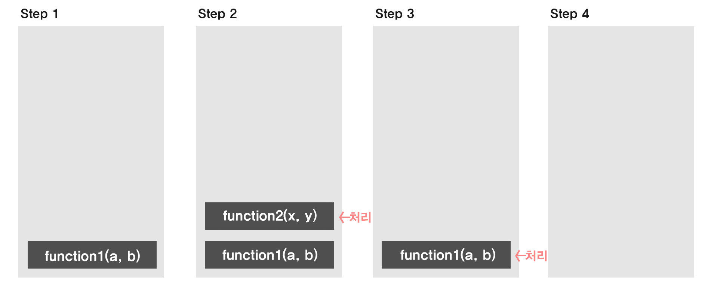

---

> ### 🙌 **소개**

오늘은 자바스크립트의 런타임에 대해 공부해보겠습니다.

그 전에 자바스크립트란 무엇일까요?
자바스크립트는 웹 개발에서 가장 널리 사용되는 언어 중 하나입니다. 자바스크립트는 비동기 작업을 효율적으로 처리하기 위해 독특한 런타임 환경을 제공합니다.

이 글에서는 자바스크립트 런타임의 주요 구성 요소와 동작 원리를 탐구하여 자바스크립트 코드가 실제로 어떻게 실행되는지 이해해보겠습니다.

> ### 자바스크립트 런타임이란?


자바스크립트 런타임은 자바스크립트 코드가 실행되는 환경을 의미합니다.
이 환경에는 자바스크립트 엔진, 콜 스택, 힙, 이벤트 루프, 콜백 큐, 마이크로태스크 큐 등이 포함됩니다. 이러한 구성 요소들이 협력하여 자바스크립트 코드가 실행되며, 특히 비동기 작업이 효율적으로 처리될 수 있도록 합니다.

> ### 자바스크립트 엔진

자바스크립트 엔진은 자바스크립트 코드를 해석하고 실행하는 핵심 구성요소 입니다. 가장 널리 사용되는 엔진은 무엇이 있을까요?

크롬의 V8, 사파리의 Webkit, 파이어폭스의 Spider Monkey 등이 있습니다.

자바스크립트 엔진은 실행시간에 메모리 관리를 위해 `메모리 힙` 과 `호출 스택` 을 사용합니다.

> ### 자바스크립트 런타임

런타임은 프로그래밍 언어가 실행되는 환경을 말합니다.

자바스크립트 런타임의 대표적인 예로는 **웹 브라우저(크롬, 파이어폭스, 익스플로어 등)**와 **Node.js**가 있습니다. 웹 브라우저는 클라이언트 측에서, Node.js는 서버 측에서 자바스크립트 코드를 실행합니다.

> ### 콜 스택(Call Stack)



**콜 스택**은 함수 호출을 관리하는 구조로, **후입선출(LIFO, Last In, First Out)** 방식으로 작동합니다. 자바스크립트가 함수를 호출할 때마다 해당 함수는 콜 스택에 추가되며, 함수가 반환되면 스택에서 제거됩니다.

> ### **메모리 힙(Heap)**

**힙**은 동적으로 할당된 메모리를 저장하는 공간입니다. 객체와 같은 변수가 이 힙에 저장되며, 자바스크립트 엔진이 메모리를 관리합니다.

> ### 이벤트 루프(Event Loop)

> _프로세스는 메모리 상에서 실행중인 작업을 뜻하는데, 이러한 프로세스 내의 실행 단위를 **스레드**라 한다_

자바스크립트 엔진은 하나의 콜스택을 가지는 **싱글 스레드**로 동작하기 때문에, 비동기 작업이 완료될 때까지 기다리지 않고 다른 작업을 계속 실행할 수 있습니다.

이벤트 루프는 콜 스택이 비어 있는지 확인하고, 비어 있으면 태스크 큐에서 작업을 콜 스택에 가져와 실행합니다.

이벤트 루프를 통해 비동기 처리 순서가 정해진다.

> ### 콜백 큐(Callback Queue)

자바스크립트에서 비동기 작업을 처리하는 두 가지 주요 큐가 있습니다:

**콜백 큐(Callback Queue)**: 이 큐는 **setTimeout**, **setInterval**과 같은 타이머 기반의 비동기 함수가 대기하는 곳입니다. 콜백 큐는 **선입선출(FIFO, First In, First Out)** 방식으로 작동하며, 이벤트 루프가 콜 스택이 비어 있음을 확인하면 이 큐에서 작업을 가져와 실행합니다.

> ### 마이크로태스크 큐(Microtask Queue)

**마이크로태스크 큐(Microtask Queue)**: 이 큐는 **Promise**와 같은 비동기 작업이 대기하는 곳으로, 콜백 큐보다 **우선순위가 높습니다**. 콜 스택이 비게 되면, 이벤트 루프는 먼저 마이크로태스크 큐에서 작업을 처리하고, 그 후에 콜백 큐에서 작업을 가져옵니다.

> ### Web API

자바스크립트는 브라우저 환경에서 실행될 때 다양한 **Web API**를 통해 비동기 작업을 처리합니다.

이 API들은 브라우저 기능을 활용하여 비동기 작업을 수행하며, 주로 네트워크 요청, 타이머 설정, DOM 조작 및 이벤트 처리와 관련됩니다. 예를 들어, **setTimeout, XHR(Ajax), fetch, XMLHttpRequest, addEventListener** 등이 있습니다.

이러한 비동기 함수들은 콜 스택을 차지하지 않고, 작업이 완료되면 해당 작업이 콜백 큐나 마이크로태스크 큐에 추가됩니다.

```jsx
console.log('start');

document.body.addEventListener('click', () => {
  console.log('callback start');

  setTimeout(() => {
    console.log('1');
    setTimeout(() => {
      console.log('3');
    }, 2000);
  }, 1000);

  setTimeout(() => {
    console.log('2');
  }, 3000);

  console.log('callback end');
});

console.log('end');
```

```jsx
// start // 콜 스택에 ‘start’ push & 실행이 되고
// end   // 콜 스택에 ‘end’ push & 실행이 됩니다
// callback start // click 이벤트 리스너가 호출되고, "callback start"가 실행됩니다.
// callback end // "callback end"가 실행됩니다.
// 1 // 첫 번째 setTimeout이 1초 후 실행됩니다.
// 3 // 두 번째 setTimeout이 3초 후 실행됩니다
// 2 // 첫 번째 setTimeout 안의 또 다른 setTimeout이 2초 후 실행됩니다
// (즉, 첫 번째 setTimeout이 실행된 후 2초).
```

> ### 비동기 작업 순서

1. **콜 스택에서 비동기 함수가 실행되면** (예: `setTimeout`), 자바스크립트 엔진은 해당 비동기 작업을 브라우저의 **Web API**에게 보냅니다. `setTimeout` 함수의 경우, 브라우저의 타이머 API가 이를 처리합니다.
2. **Web API는 비동기 작업을 수행한 후**, 지정된 시간이 경과하면 해당 작업의 **콜백 함수를 이벤트 루프를 통해 콜백 큐로** 넘깁니다.
3. **이벤트 루프는 콜 스택이 비어 있을 때**, 콜백 큐에 대기 중인 콜백 함수를 콜 스택으로 옮깁니다.
4. **콜백 함수가 실행되고**, 실행이 끝나면 콜 스택에서 제거됩니다.

> ### 결론

자바스크립트는 **싱글 스레드** 기반으로 동작하는 스크립트 언어이지만 **멀티스레드 환경**에서 여러 작업을 동시에 처리하는 것처럼 보일 수 있습니다. 이는 자바스크립트가 **이벤트 루프**와 **비동기적인 콜백 처리** 메커니즘을 사용하기 때문입니다.

자바스크립트는 하나의 콜 스택을 사용해 동작하지만, **이벤트 루프**와 **웹 API**의 도움을 받아 블로킹 없이 여러 작업을 처리할 수 있습니다.

예를 들어, `setTimeout`이나 `fetch`와 같은 비동기 함수가 호출되면, 해당 작업은 콜 스택에서 즉시 처리되지 않고, 웹 API를 통해 백그라운드로 전달됩니다. 작업이 완료되면 콜백 함수가 콜백 큐로 보내지고, 콜 스택이 비어 있을 때 이벤트 루프가 이 콜백 함수를 콜 스택으로 다시 가져와 실행하게 됩니다.

이와 같은 비동기 처리 메커니즘 덕분에 자바스크립트는 싱글 스레드 언어임에도 불구하고 **블로킹 없이 여러 작업을 동시에 처리하는 것처럼** 동작할 수 있으며, 효율적으로 동작할 수 있습니다.
